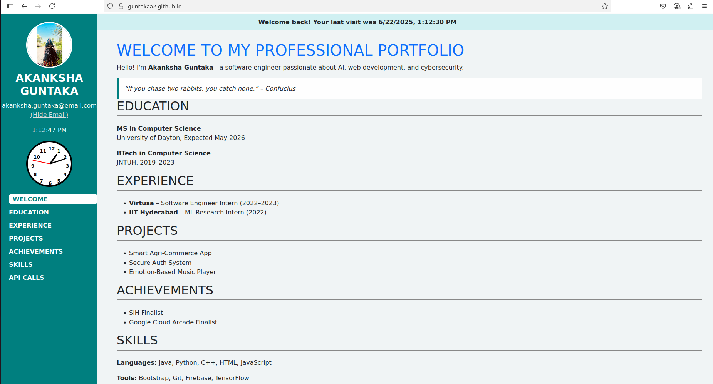
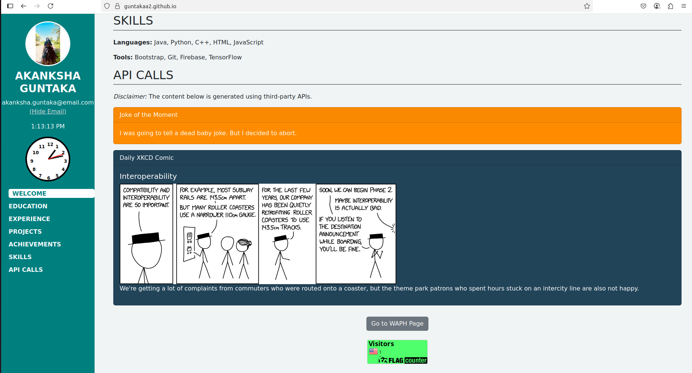
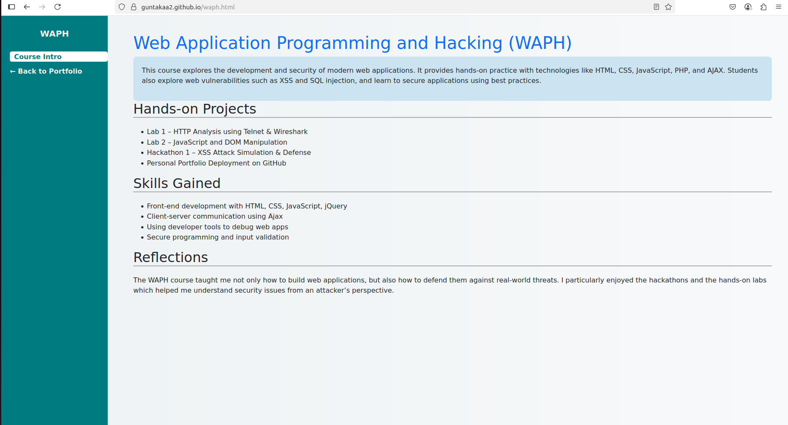

### WAPH-Web Application Programming and Hacking

## Instructor: Dr. Phu Phung

## Student

**Name**: akanksha guntaka

**Email**: guntakaa2@udayton.edu

**Short-bio**: Akanksha has keen interests in ethical hacking and secure software development

---

## Overview

In this project, I created and deployed a professional personal portfolio website using GitHub Pages. The website includes resume information, professional background, contact info, skills, and a dedicated page introducing the WAPH course. I also implemented interactive features using JavaScript, jQuery, and public Web APIs such as JokeAPI and XKCD comic API.

Additionally, the website includes a digital and analog clock, a visit-tracking banner using cookies, and a flag counter. This assignment helped me reinforce both front-end development and web security practices.

- **Deployed Website:** [https://guntakaa2.github.io/](https://guntakaa2.github.io/
- **GitHub Repository:** [https://github.com/guntakaa2/guntakaa2.github.io](https://github.com/guntakaa2/guntakaa2.github.io)

---

### Task 1: Portfolio Setup

- Set up GitHub repository and enabled GitHub Pages.
- Created `index.html` as the landing page.
- Added sidebar with headshot, contact, navigation, and clocks.

### Task 2: Resume and Profile Content

- Added education, experience, projects, achievements, and skills.
- Styled using Bootstrap framework.
- Made site mobile responsive.

### Task 3: WAPH Course Page (waph.html)

- Created a new page that describes the WAPH course.
- Included summary of hands-on labs, hackathons, and skills gained.
- Linked this page from the main portfolio.

### Task 4: JavaScript and Interactivity

- Implemented Digital Clock, Analog clock.
- Added Email with hide/show script.
- Added visit tracker using cookies

### Task 5: API Integration

- JokeAPI: Loaded a new joke.
- XKCD Comic API: Displayed the latest comic dynamically.
- Included disclaimer for third-party content.

### Task 6: Page Tracker / Analytics

- Added Flag Counter to the bottom of the main page. which counts country-based visits.

## Screenshot:

  
**index page with portfolio**

  
**API integration**

**WAPH course page**

## Conclusion

This project allowed me to integrate HTML, CSS, Bootstrap, JavaScript, and external APIs into a cohesive professional portfolio. I also practiced using cookies for client-side storage and GitHub Pages for hosting. The hands-on nature of this assignment helped me better understand DOM manipulation, asynchronous requests, and responsive design.